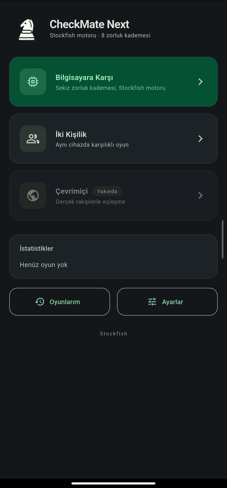
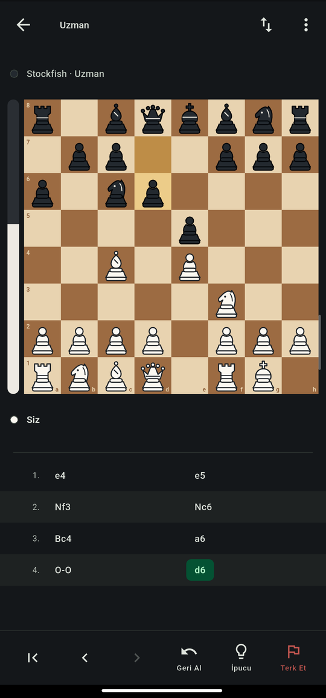

# CheckMate Next

Stockfish motoruyla çalışan, sekiz zorluk kademeli satranç uygulaması. Motor
cihazda çalışır; internet bağlantısı gerekmez, hiçbir veri toplanmaz.

{: width="240" }
{: width="240" }

## Öne çıkanlar

- Tam FIDE kuralları: rok, geçerken alma, terfi, elli hamle, üç ve beş kez
  tekrar, yetersiz materyal
- Sekiz zorluk kademesi, yaklaşık 600 Elo'dan motorun tam gücüne kadar
- Süre kontrolü ve Fischer artışı, değerlendirme çubuğu, ipucu, geri alma
- Hamle listesi ve PGN dışa aktarma
- Aynı cihazda iki kişilik oyun
- Türkçe ve İngilizce

## Bağlantılar

- [Kaynak kodu](https://github.com/shellnoq/checkmate-next) — GPLv3
- [Gizlilik politikası](privacy/)

Uygulama Stockfish satranç motorunu içerir; Stockfish GNU General Public
License v3 ile lisanslıdır ve bu lisans tüm dağıtımı kapsar.
